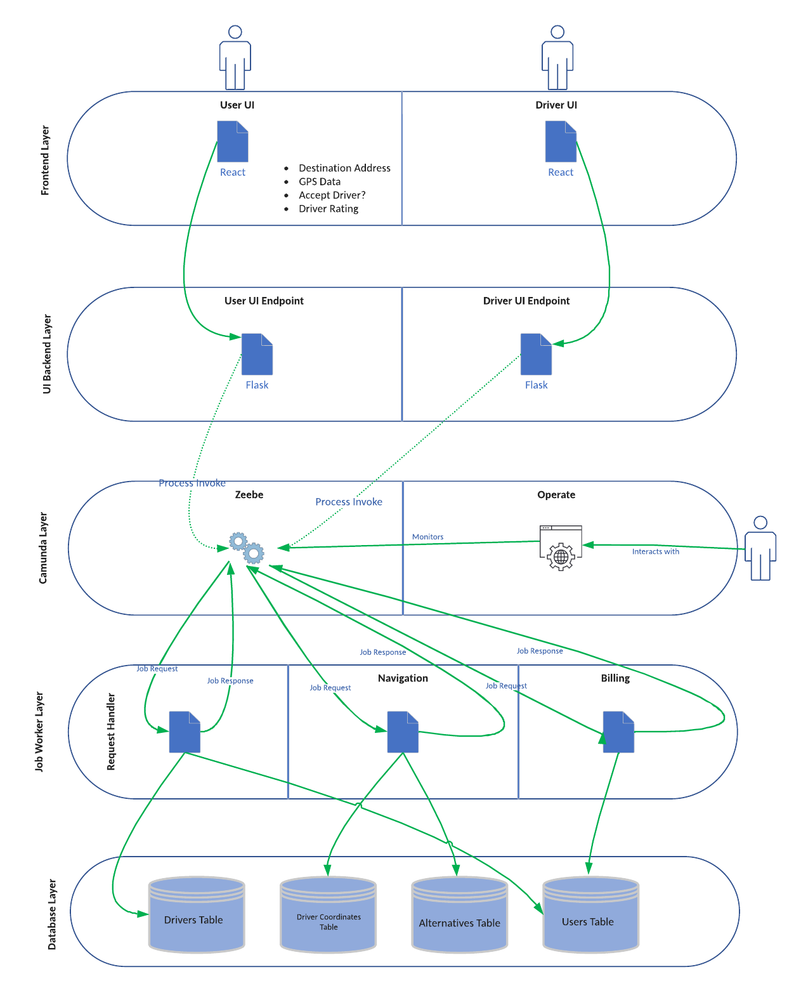

# Workflow - TaxiNow!

# Where to put/find things

## In the project-source-code Folder

Our actual system files. Add your completed files to the right sub-directory (i.e. front-end, api-gateway, back-end). Sub-directories are based on the layers of the architecture diagram.

## In the template-files-and-resources Folder

Example code to work with various BPMN elements and skeleton files for creating classes that connect to Camunda, as well as necessary files to import the dependencies.

# How to Build the System

## Front-end (React)

The front-end will communicate user requests by hitting an API endpoint on the running API gateways. The front-end does not communicate directly with Camunda.

## API Gateway - User Tasks (Java and Spring Boot Web)

One API gateway for the User UI and one for the Driver UI. The API gateway sends the variables passed from the front-end to the running Camunda engine, which orchestrates the process. The API gateways are responsible for BPMN user tasks.

## Back-end - Service Tasks (Java Job Worker)

As the process moves along the Camunda Engine, known as Zeebe, will create "jobs" for each step in the process. Service tasks are completed by "Job Worker" programs that are written in Java. These programs run and continually check if there are new jobs waiting to be completed in Zeebe. With every step taken along the process diagram, a new Job is created (containing variables required to do the job of each task), and the listening Job Workers claim the jobs assigned to their respective tasks, do the work, and return the processed data back to Zeebe, in JSON format. Zeebe then takes those variables, passes them to the next task, and the process continues.

## Database

Any time a service task needs data that is stored in a database, it retrieves it using standard SQL queries.

# How to Deploy the System - The Five Servers

## Server 1 - Camunda Engine
The Canunda engine, which powers Zeebe, Tasklist, and Operate, lives in the Camunda Cloud.

## Server 2 - Front-end
The React files could be located on a dedicated server.

## Server 3 - API Gateways (User and Driver)
The API gateway which allows the front-end to communicate with the back-end services could be located on a dedicated server.

## Servers 4, 5, 6 - Back-end Swimlanes (Request Handler, Navigation, Billing)
These three modules will have their own servers each (sort of like a microservices architecure). The java files that live within them can either be one for all or one for each. We will see once implemented (EDIT HERE WHEN DECIDED).
