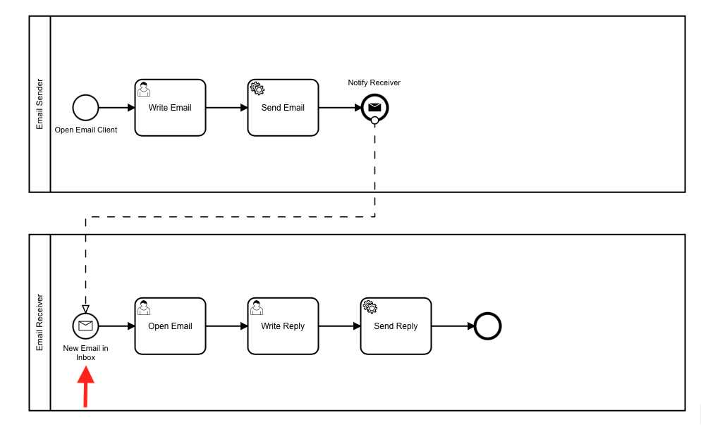

# Templates and Resources

## Writing Code for Camunda

### Deploying and Starting Processes with "None Start"


```
try (ZeebeClient client = ZeebeClientFactory.getZeebeClient()) {
            client.newDeployResourceCommand()
                    .addResourceFromClasspath("send-email.bpmn") // Filename of diagram in IntelliJ project resources folder
                    .send()
                    .join();

            final ProcessInstanceEvent event = client.newCreateInstanceCommand()
                    .bpmnProcessId("send-email")
                    .latestVersion()
                    .variables(Map.of("message_content", "Hello from the Java get started"))  // variables in "key1, value1, key2, value2" format
                    .send()
                    .join();

}       
```

### Deploying and Starting Processes with "Message Start"



```
try (ZeebeClient client = ZeebeClientFactory.getZeebeClient()) {
            client.newDeployResourceCommand()
                    .addResourceFromClasspath(BPMN_FILE_NAME)
                    .send()
                    .join();

            // Correlation key should be blank for starting new processes
            client.newPublishMessageCommand().messageName("start2-msg").correlationKey("").variables("").send().exceptionally( throwable -> { throw new RuntimeException("Could not publish message", throwable); });;
}
```

### User Tasks


The io.camunda.tasklist dependency must be imported into the IntelliJ project.

```
SaasAuthentication sa = new SaasAuthentication("F5JcQaWof3-6q3py6wSKrgFLaUA6W_iO", "zzeeXpNVKVvKMkVTSR3eudDU1NKV0kl4_FNh4q_k6D0is-S5vOrHXBzNlFGU2~hJ");
CamundaTaskListClient client = null;
try {
            client = new CamundaTaskListClient.Builder().authentication(sa)
                    .taskListUrl("https://bru-2.tasklist.camunda.io/10f14fca-c94d-40e7-be13-18e9a6803cf1/graphql").build();
            System.out.println("Client connection successful: " + client);

            List<Task> tasks = client.getTasks(true, USER_TASK_ASSIGNEE, TaskState.CREATED, null); // CHANGE the user task id in the constants section as needed

            // Complete all tasks
            for(Task task : tasks) {


                // TODO get the variables from the task, do the business logic to complete the user task, and return the results


                client.completeTask(task.getId(), Map.of("user-dest-addr", "Kev's house")); // ADD the return variables (i.e. the user's destination address
              
            }
}
```

### Message Throws


A message throw event is essentially a service task with this line of code as the business logic:
```
// messageName -> This is what triggers the corresponding message receive task to become active
// correlationKey -> This is to identify the process. For example, this could be an emailID, such as email01
// variables -> variables expected by the message catch event, sent in JSON format
client.newPublishMessageCommand().messageName("message-start-msg").correlationKey("").variables("").send().exceptionally( throwable -> { throw new RuntimeException("Could not publish message", throwable); });;
```

### Service Tasks


```
private static final Logger LOG = LogManager.getLogger(EmailWorker.class);

    public static void main(String[] args) {
        try (ZeebeClient client = ZeebeClientFactory.getZeebeClient()) {
            client.newWorker().jobType("email").handler((jobClient, job) -> {
                final String message_content = (String)job.getVariablesAsMap().get("message_content");

                LOG.info("Sending email with message content: {}", message_content);

                // START - Return variables preparation
                Map<String, Object> variablesMap = new HashMap<>();
                variablesMap.put("returnMsg", "Email sent successfully!");
                // END - Return variables preparation

                // Send the job completed command to Camunda. This is how Camunda knows to move to the next task in the process
                jobClient.newCompleteCommand(job.getKey()).variables(variablesMap).send()
                        .whenComplete((result, exception) -> {
                            if (exception == null) {
                                LOG.info("Completed job successfully with result: " + result);
                            } else {
                                LOG.info("Failed to complete job", exception);
                            }
                        });
            }).open();

            // run until System.in receives exit command
            waitUntilSystemInput("exit");
        }
    }

    private static void waitUntilSystemInput(final String exitCode) {
        try (final Scanner scanner = new Scanner(System.in)) {
            while (scanner.hasNextLine()) {
                final String nextLine = scanner.nextLine();
                if (nextLine.contains(exitCode)) {
                    return;
                }
            }
        }
    }
```
