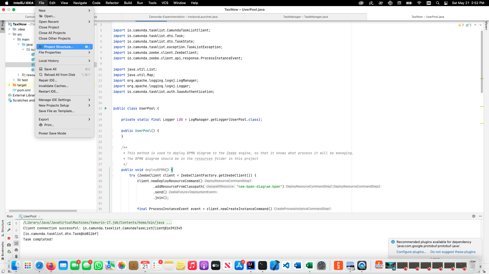
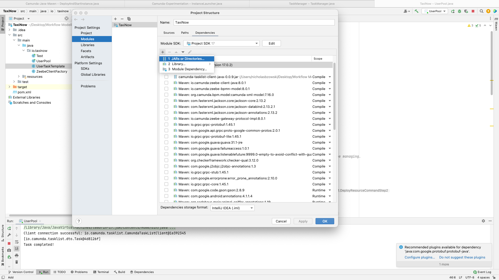

# Instructions

## Setting up project

Create a new project Maven using IntelliJ Idea. Copy and paste the contents of the pom.xml file here into the one in your local project.

## Import the TaskList client dependency

The in order to complete User Tasks, the TaskList client needs to be imported into your IntelliJ Idea project, so that the Java program can communicate with the Camunda Tasklist engine.

